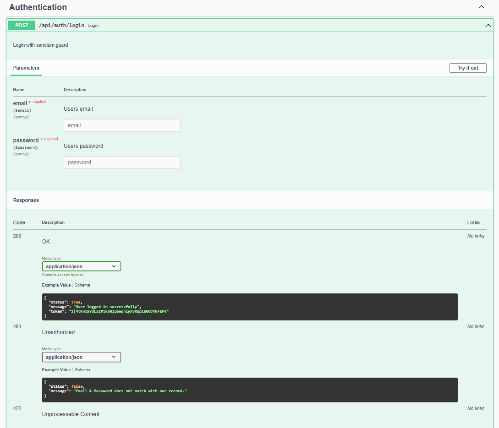
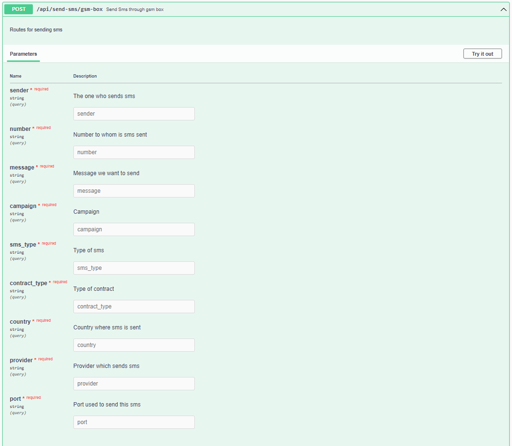
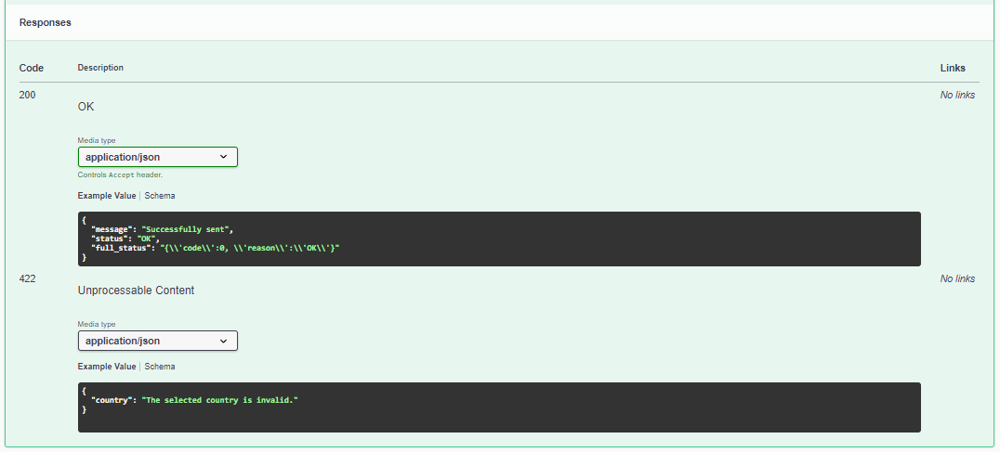
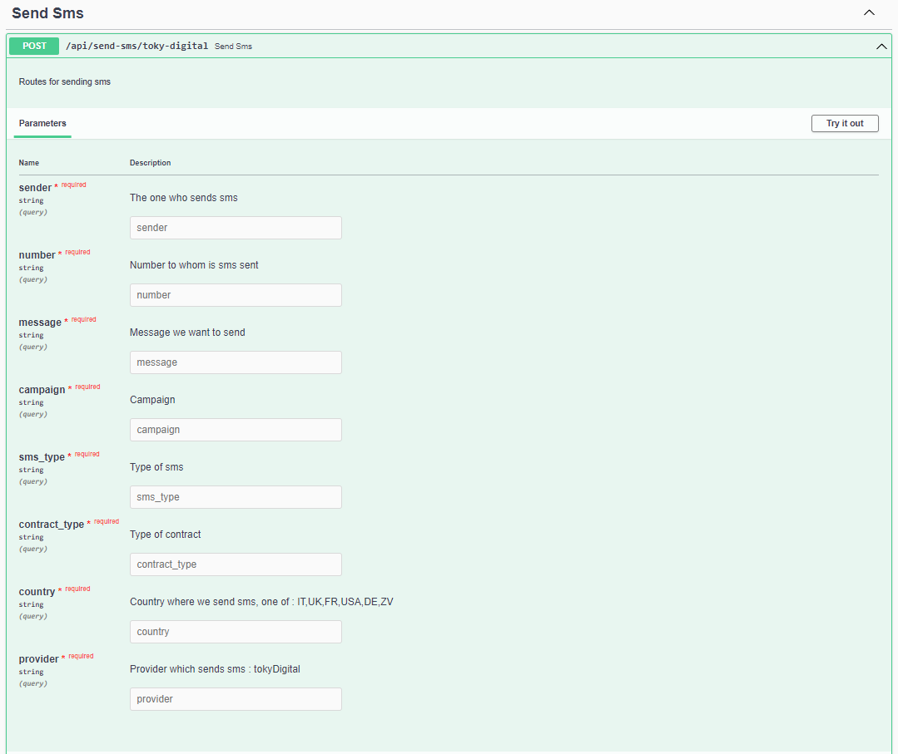
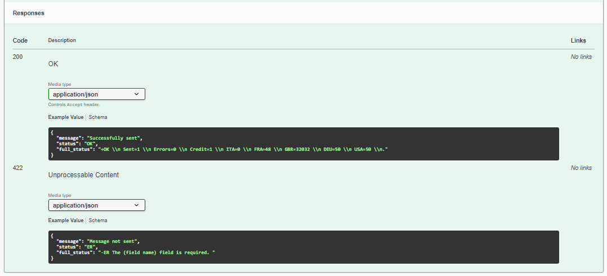
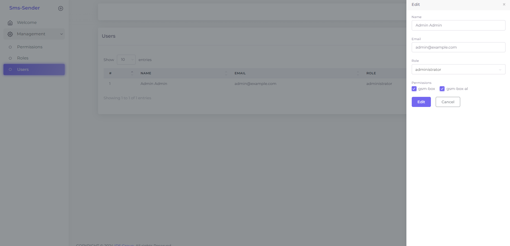
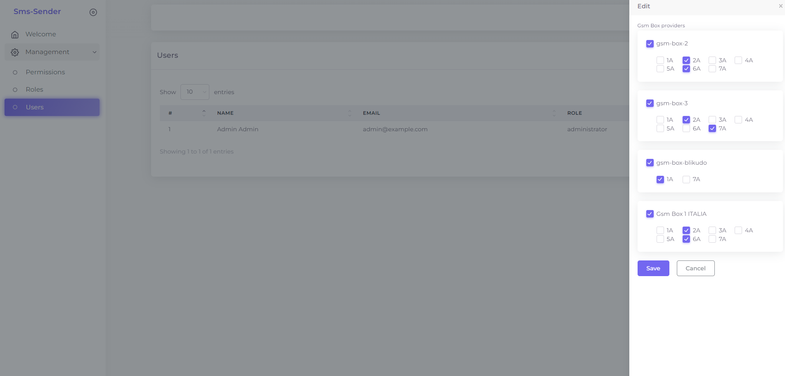

<h1 style="color: #2453e8" align="center">SMS SENDER</h1>

## Introduction

SMS Sender is a simple, efficient tool designed to enable easy sending of SMS messages through various APIs across
projects or companies.

## Installation

To install the SMS Sender Laravel project, follow these steps:

1. Clone the repository:

    ```bash
    git clone https://github.com/sergio-xs/sms-sender.git
    cd sms-sender
    ```

2. Install Laravel Sail, which is a light-weight command-line interface for interacting with Laravel's default Docker
   development environment. Sail is included as a dev dependency within the Laravel application's `composer.json` file:

    ```bash
    composer install (--ingore-platform-reqs)
    ```

3. Copy the `.env.example` file to create a `.env` file which will be used for your environment configuration:

    ```bash
    cp .env.example .env
    ```

4. Generate an application key:

    ```bash
    php artisan key:generate
    ```

5. Start the Docker containers using Sail. If Docker Desktop is not already running, you'll need to start it before
   executing this command:

    ```bash
    ./vendor/bin/sail up -d
    ```

   This command will build the Docker containers for your application and start them. The `-d` flag is used to run the
   containers in the background.

6. After the Docker containers are running, you can access the application in your web browser at: `http://localhost`.
    ```bash
    ./vendor/bin/sail npm install
    ./vendor/bin/sail npm run build
    ```

   This will install all necessary Node.js modules and compile your assets using Laravel Mix.

7. (Optional) If your application interacts with a database, run the migrations:

    ```bash
    ./vendor/bin/sail artisan migrate
    ```

## Application Preview

Here are some screenshots of the SMS Sender application in action:

### Authentication



### GSM Box

Request

Response


### Toky Digital

Request


Response


### Manage Users



### Manage User Permissions


